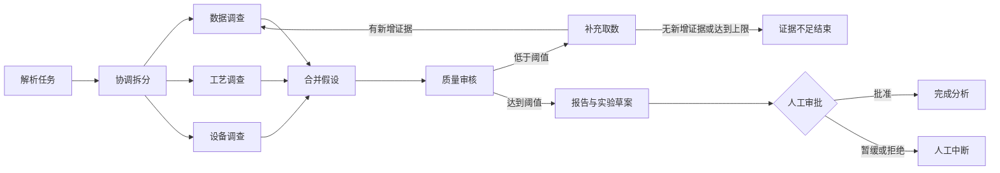

# 第六章：多智能体质量根因分析团队

本示例对应
[`Chapter6-DSExt-MultiAgentQualityAnalysis.md`](../../docs/chapter6/Chapter6-DSExt-MultiAgentQualityAnalysis.md)，
围绕 P-600 产品尺寸均值上移与一次合格率下降，组织协调、数据、工艺、设备、质量审核
和人工负责人六类角色，完成并行取证、假设合并、证据评分、补数回退和人工审批。

系统仅依赖 Python 标准库，读取本目录脱敏教学 CSV，不调用外部 LLM/API，也不连接
生产系统。`LangGraph-style` 与 `AutoGen-style` 是对编排语义的离线教学实现；基础章节
的真实框架 API 示例仍位于 `code/chapter6/`。

## 目录

```text
chapter6/
├── agents/
│   └── team.py
├── workflows/
│   ├── state_graph_workflow.py
│   ├── conversation_workflow.py
│   ├── reporting.py
│   └── common.py
├── schemas/
│   └── models.py
├── tools/
│   └── industrial_tools.py
├── data/
│   ├── quality_results.csv
│   ├── process_timeseries.csv
│   ├── equipment_alarms.csv
│   ├── maintenance_records.csv
│   └── process_specs.csv
├── tests/
│   └── test_quality_rca_team.py
├── run_quality_rca_team.py
├── compare_workflows.py
└── README.md
```

## 快速运行

在仓库根目录运行主状态图，并由命令行模拟人工负责人批准验证计划：

```bash
python -X utf8 code-dsext/chapter6/run_quality_rca_team.py \
  --framework state-graph --human-decision approve
```

默认人工决策为 `defer`，系统会停在人工审批节点，退出码为 `2`：

```bash
python -X utf8 code-dsext/chapter6/run_quality_rca_team.py
```

运行证据不足案例，观察“补充取数—无新增证据—有界停止”：

```bash
python -X utf8 code-dsext/chapter6/run_quality_rca_team.py \
  --scenario insufficient --human-decision approve
```

运行顺序对话链，使用同一角色、数据、消息和证据契约：

```bash
python -X utf8 code-dsext/chapter6/run_quality_rca_team.py \
  --framework conversation --human-decision approve
```

输出完整 JSON：

```bash
python -X utf8 code-dsext/chapter6/run_quality_rca_team.py \
  --human-decision approve --output json
```

比较同一案例的两种编排：

```bash
python -X utf8 code-dsext/chapter6/compare_workflows.py
```

正常完成退出码为 `0`；参数、数据或文件错误为 `1`；证据不足、人工暂缓或人工拒绝为
`2`。

## 角色与消息契约

| 角色 | 唯一职责 | 主要输入 | 主要输出 |
| --- | --- | --- | --- |
| 协调智能体 | 拆分任务、合并重复假设、维护状态 | 分析任务、专业报告 | 调查任务、合并候选、实验草案 |
| 数据分析智能体 | 构造对照组并量化质量漂移 | 批次质量结果 | 质量差异证据、数据侧假设 |
| 工艺智能体 | 计算参数漂移并核对规范 | 工艺时序、工艺规范 | 参数漂移证据、工艺机理假设 |
| 设备智能体 | 核对告警、维护和部件状态 | 设备告警、维护记录 | 设备上下文证据、设备假设 |
| 质量审核智能体 | 审核证据强度、时间一致性和可反证性 | 候选、证据账本 | 证据评分、补数请求 |
| 人工负责人 | 批准、暂缓或拒绝验证计划 | 审核结果、实验草案 | 明确范围的人工决策 |

所有跨智能体消息使用 `AgentMessage`，强制携带：

- `task_id`
- `evidence_ids`
- `claim`
- `confidence`
- `open_questions`

`ReviewScore` 必须引用证据 ID；没有证据的观点不能进入审核结果，因此评分或角色投票
不能替代工具证据。

## 主状态图



默认限制为最多 3 轮、12 次只读工具调用、补数轮至少新增 1 条证据。任何一个条件
不满足都会留下节点轨迹并停止，不会让智能体无限对话。

## 数据与证据契约

| 文件 | 关键字段 | 用途 |
| --- | --- | --- |
| `quality_results.csv` | 批次、产品、设备、检验数、合格数、尺寸均值 | 构造正常/异常对照组 |
| `process_timeseries.csv` | 时间、批次、温度、进给、夹紧压力 | 计算确定性参数漂移 |
| `equipment_alarms.csv` | 时间、批次、设备、报警码、等级 | 核对异常窗口设备事件 |
| `maintenance_records.csv` | 设备、维护时间、结果、下次到期 | 核对维护逾期与事后动作 |
| `process_specs.csv` | 产品、参数、上下限、版本、来源 | 判断越限并记录规范范围 |

每次工具调用生成不可变 `Evidence`，记录 `evidence_id`、`status`、`query`、
`data_range`、`source_files`、确定性指标与限制。报告中的质量数值、工艺参数、设备
告警和规范结论均引用这些证据 ID。

五份 CSV 均为 2026-07-26 至 2026-07-27 人工构造的 v1 脱敏教学数据。
`TEACHING-DEMO-*` 不是生产规范、报警阈值或 EHS 依据。

## 输出

报告固定包含：

- 候选根因排序与证据图；
- 被排除假设与反证；
- 缺失数据和补充采集请求；
- 仅由人工负责人批准的验证实验计划；
- 完整结构化消息、工具调用与节点轨迹；
- 相关性、因果性和生产安全边界。

默认案例会把“主轴温升引发热尺寸漂移”列为优先验证候选，同时保留测量系统偏移等
替代解释。即使人工批准实验，也不等于确认最终根因。

## 两种编排的工程差异

主实现选择显式状态图，因为质量分析更看重状态可见、并行调查、失败恢复、类型约束、
人工中断和审计回放。顺序对话链保留为对照：

| 维度 | 状态图 | 对话链 |
| --- | --- | --- |
| 状态可见性 | 每个节点、路由和停止原因显式保存 | 需从消息顺序重建 |
| 并发 | 数据、工艺、设备三线并行 | 专业角色依次发言 |
| 恢复 | 可回到补数节点并复用证据 | 通常需要重放后续对话 |
| 类型约束 | 状态和消息共享 dataclass | 消息可约束，流程状态较分散 |
| 人工介入 | 独立 `human_gate` | 人工作为最后一轮角色 |
| 调试成本 | 节点较多，但失败定位直接 | 实现直观，长对话定位较难 |

## 验证

```bash
python -X utf8 -m unittest discover \
  -s code-dsext/chapter6/tests -p "test_*.py" -v
```

测试覆盖结构化消息校验、写工具拒绝、并行状态图、人工批准/暂缓、证据不足回退、
证据引用完整性，以及同一案例两种编排的最高候选一致性。

## 安全边界

系统只读固定目录内的脱敏 CSV，不接受任意数据路径、命令或动态工具。工具箱没有
PLC、MES、DCS、配方或工艺参数写入能力。验证计划只生成建议，不自动执行；最终
根因必须由质量、工艺和设备负责人复核，并由人工负责人签署。
